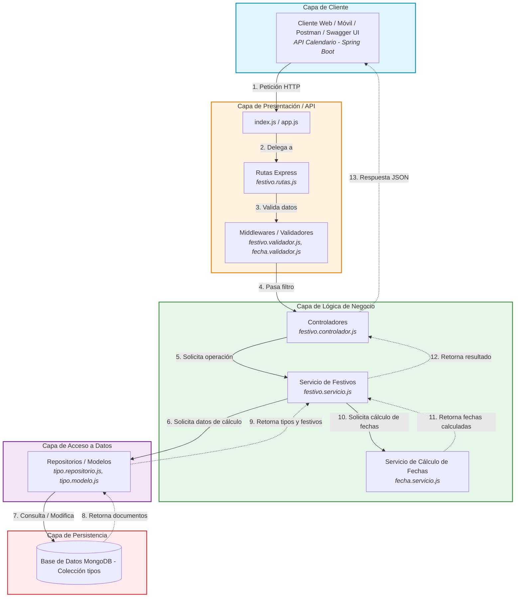

# Diagrama de Arquitectura por Capas - API Festivos

API RESTful desarrollada en Express JS sobre MongoDB.

La arquitectura organiza los componentes en capas jerárquicas horizontales, donde
cada capa tiene una responsabilidad única y solo interactúa con la capa
inmediatamente inferior, o con la superior al responder.

## Responsabilidad de cada capa

| Capa | Responsabilidad |
|---|---|
| Capa de Cliente | Consume la API mediante peticiones HTTP |
| Capa de Presentación / API | Recibe la petición, enruta hacia el controlador y valida el formato de los datos de entrada (por ejemplo, que año, mes y día sean numéricos) |
| Capa de Lógica de Negocio | Ejecuta las operaciones de la API y realiza el cálculo de las fechas festivas |
| Capa de Acceso a Datos | Traduce las operaciones de negocio en consultas y modificaciones sobre MongoDB. Como los festivos están embebidos en los documentos de la colección `tipos`, el repositorio se llama `tipo.repositorio.js` |
| Capa de Persistencia | Almacena la colección `tipos` con los datos para calcular los festivos |

El flujo numerado del diagrama corresponde a las operaciones que requieren cálculo de
fechas (verificar una fecha y listar los festivos de un año). Las operaciones CRUD
solo recorren los pasos 1 a 9 y 12 a 13, sin pasar por el Servicio de Cálculo de Fechas.

## Operaciones de la API

| Operación | Método | Ruta |
|---|---|---|
| Listar festivos | GET | `/api/festivos` |
| Obtener un festivo | GET | `/api/festivos/:id` |
| Agregar un festivo | POST | `/api/festivos/agregar` (el cuerpo indica el `id` del tipo) |
| Modificar un festivo | PUT | `/api/festivos/modificar/:id` |
| Eliminar un festivo | DELETE | `/api/festivos/:id` |

El `:id` de estas rutas es el `id` del festivo, único entre todos los festivos de la
colección (ver [diagrama objetual](diagrama-objetual-api-festivos.md)).
| Verificar si una fecha es festiva | GET | `/api/festivos/verificar/:anio/:mes/:dia` |
| Listar los festivos de un año | GET | `/api/festivos/obtener/:anio` |

El CRUD opera sobre los datos de cálculo de los festivos, no sobre fechas. No hay CRUD
para los tipos de festivo, porque en Colombia solo existen los 4 tipos ya definidos. Por ejemplo,
agregar el festivo de la Virgen de Chiquinquirá consiste en registrar su día, mes y el
tipo de festivo al que pertenece.

La operación **listar los festivos de un año** es la que consume la API Calendario
desarrollada en Spring Boot.

## Servicio de Cálculo de Fechas

Componente que aísla la lógica de fechas, requerida por la verificación de fecha
festiva y por el listado de festivos de un año.

Sus responsabilidades son:

- Calcular el domingo de Pascua de un año a partir de la fórmula
  `dias = d + ((2b + 4c + 6d + 5) MOD 7)`, donde `a = Año MOD 19`, `b = Año MOD 4`,
  `c = Año MOD 7` y `d = (19a + 24) MOD 30`. El resultado son los días transcurridos
  después del 15 de marzo hasta el domingo de Ramos, y el domingo de Pascua es 7 días
  después.
- Sumar o restar los días indicados en `diasPascua` a la fecha del domingo de Pascua,
  para los festivos de tipo 3 y 4.
- Trasladar una fecha al siguiente lunes, para los festivos de tipo 2 y 4. Si la fecha
  ya cae en lunes, se mantiene.
- Validar que una fecha recibida exista en el calendario (por ejemplo, el 35 de febrero
  no es válida). El formato de los datos de entrada lo valida previamente la capa de
  presentación.
