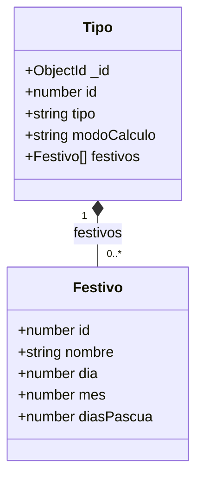

# Diagrama Objetual - API Festivos

Modelo de datos de la base de datos MongoDB `festivos`.

MongoDB almacena documentos en formato JSON, por lo que el modelo se representa
mediante un diagrama de clases donde las clases solo contienen estructura de datos
(sin métodos).

La colección `tipos` contiene un documento por cada tipo de festivo, y cada documento
embebe un arreglo de los festivos que se calculan con ese tipo.

**Importante:** la base de datos no almacena fechas festivas, almacena los datos
necesarios para calcularlas.

## Descripción de las clases

### Tipo
Representa un documento de la colección `tipos`.

| Atributo | Tipo | Descripción |
|---|---|---|
| _id | ObjectId | Identificador interno generado automáticamente por MongoDB |
| id | number | Identificador del tipo de festivo (1 a 4) |
| tipo | string | Nombre del tipo |
| modoCalculo | string | Descripción de cómo se calcula la fecha |
| festivos | Festivo[] | Arreglo de objetos `Festivo` |

Tipos existentes:

| id | tipo | Modo de calcularlo |
|---|---|---|
| 1 | Fijo | No se puede variar |
| 2 | Ley de Puente festivo | Se traslada la fecha al siguiente lunes |
| 3 | Basado en el domingo de pascua | Se suman los días indicados al domingo de Pascua |
| 4 | Basado en el domingo de pascua y Ley de Puente festivo | Se suman los días al domingo de Pascua y se traslada al siguiente lunes |

### Festivo
Objeto embebido dentro del arreglo `festivos` de un `Tipo`.

| Atributo | Tipo | Descripción |
|---|---|---|
| id | number | Identificador del festivo, único entre todos los festivos de la colección (1 a 19) |
| nombre | string | Nombre del festivo |
| dia | number | Día del mes del festivo. Solo aplica a los tipos 1 y 2 |
| mes | number | Mes del festivo. Solo aplica a los tipos 1 y 2 |
| diasPascua | number | Días a sumar o restar al domingo de Pascua. Solo aplica a los tipos 3 y 4 |

Los atributos que no aplican a un tipo se manejan por convención: `dia` y `mes` se
almacenan en `0` para los tipos 3 y 4, y `diasPascua` no existe en los festivos de los
tipos 1 y 2.

El `id` del festivo permite identificarlo directamente en las operaciones de consulta,
modificación y eliminación de la API, sin necesidad de indicar el tipo al que pertenece.
Al agregar un festivo, en cambio, sí se debe indicar el `id` del tipo en el que se va a
registrar. El `id` del nuevo festivo no lo envía el cliente: lo genera la API como el
mayor `id` existente más 1.
